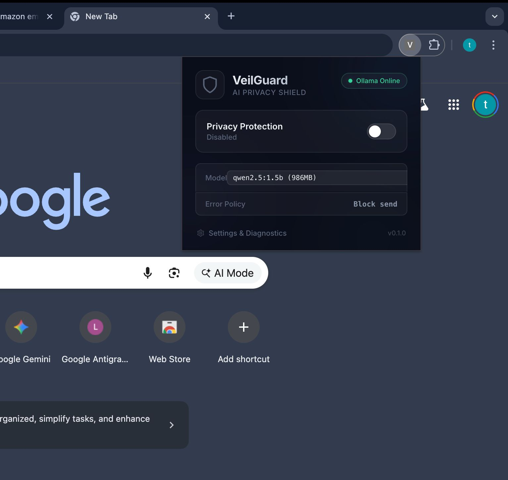
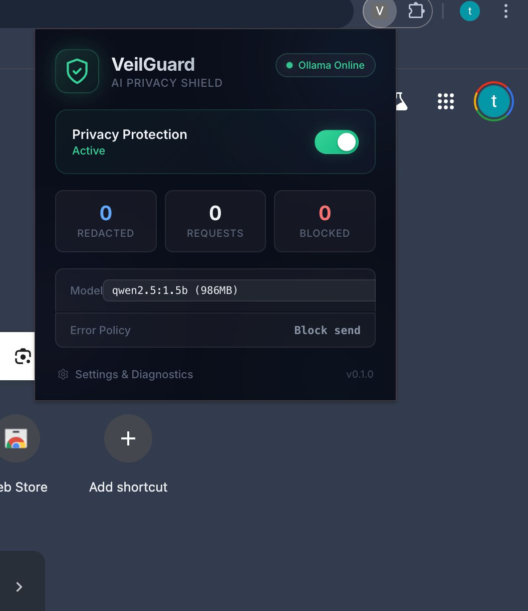
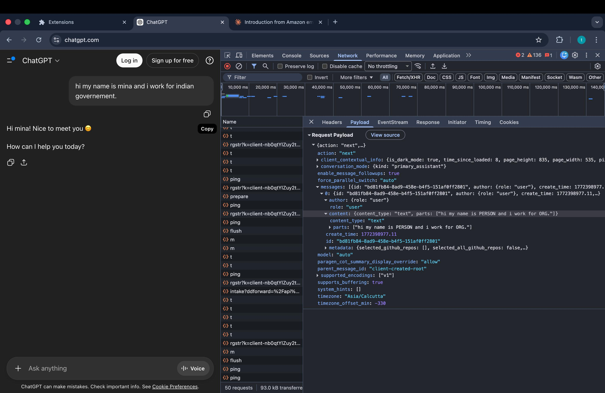
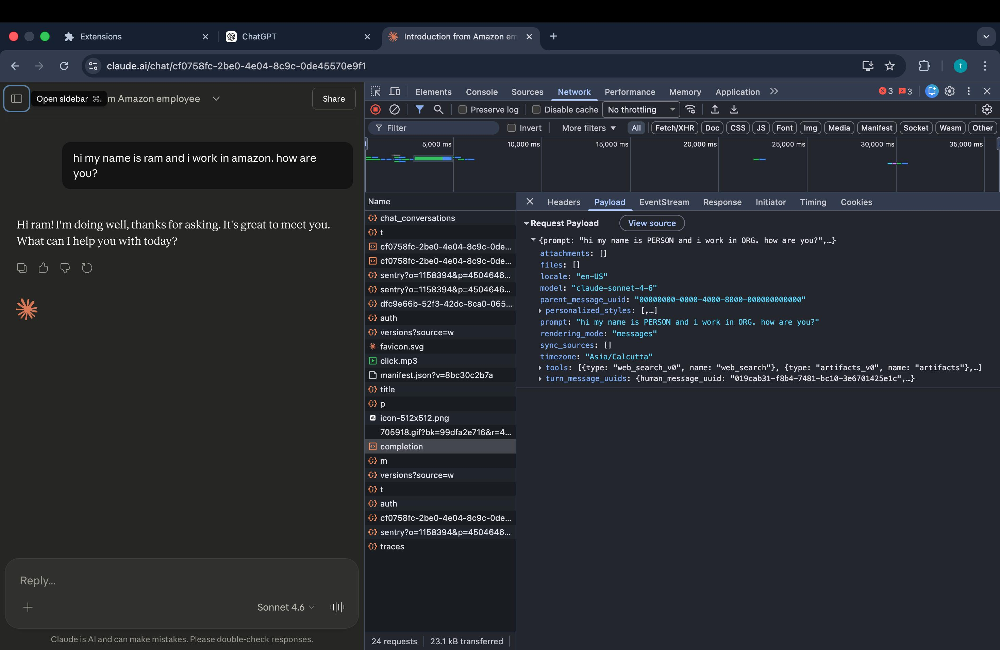
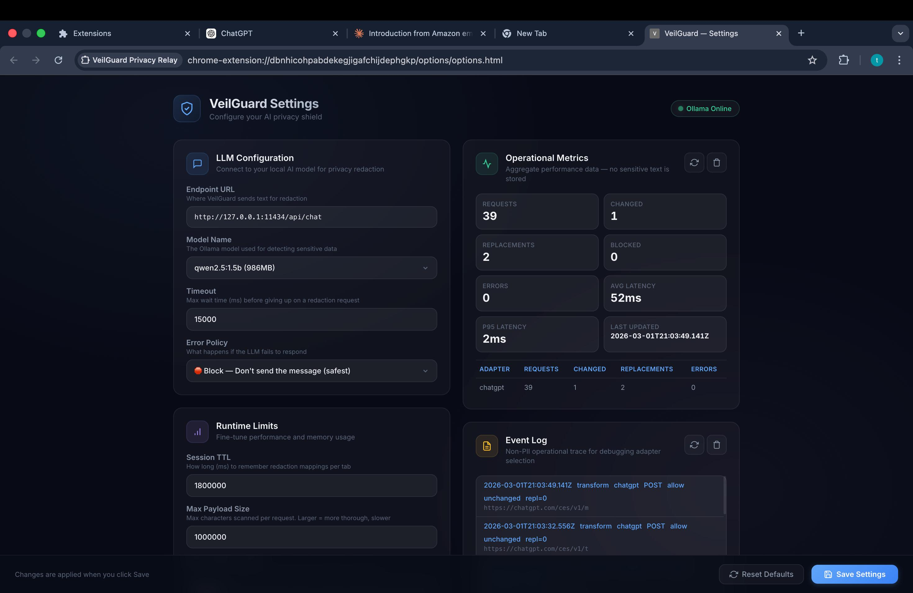
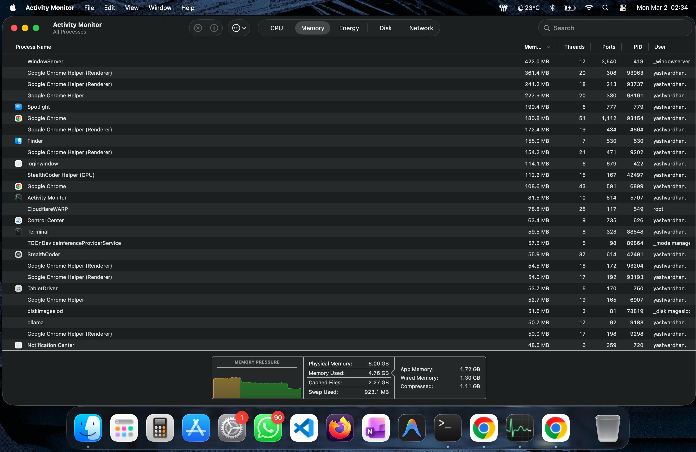

# VeilGuard — AI Privacy Shield

> A Chrome extension that automatically detects and redacts sensitive information (names, emails, API keys, addresses, etc.) before your prompts reach AI chatbots like ChatGPT, Claude, and Gemini — powered by a local AI model running on your machine.

**Your data never leaves your device.** VeilGuard uses [Ollama](https://ollama.com) to run a small language model locally that identifies and masks PII in real-time.

---

## 📸 Screenshots

<p align="center">
  
  &nbsp;&nbsp;
  
</p>
<p align="center"><em>Left: Extension disabled &nbsp;|&nbsp; Right: Protection active with live stats</em></p>

<p align="center">
  
</p>
<p align="center"><em>ChatGPT — network payload shows PII replaced with PERSON and ORG placeholders</em></p>

<p align="center">
  
</p>
<p align="center"><em>Claude — same redaction: real names and companies never reach the server</em></p>

<p align="center">
  
</p>
<p align="center"><em>Advanced settings — LLM config, operational metrics, event log, and runtime limits</em></p>

<p align="center">
  
</p>
<p align="center"><em>Ollama uses only ~50 MB RAM — lightweight enough to run in the background all day</em></p>

---

## ✨ Features

- **Real-time PII redaction** — Names, emails, phone numbers, API keys, passwords, addresses, IBANs, SSNs, and more are detected and replaced with safe placeholders before being sent.
- **Automatic rehydration** — AI responses containing placeholders are seamlessly restored to original values in the browser so you see the real content.
- **Multi-platform support** — Works with ChatGPT, Claude, Gemini, and any AI chat service.
- **100% local processing** — Powered by Ollama running on your machine. No cloud APIs, no data collection.
- **Lightweight model** — Uses `qwen2.5:1.5b` (~1GB) by default for fast, low-memory redaction.
- **One-click toggle** — Enable/disable protection instantly from the popup.
- **Model management** — Choose from any Ollama model via the dropdown, with automatic RAM cleanup on disable.
- **Setup guide** — Built-in platform-specific setup instructions for macOS, Windows, and Linux.
- **Advanced settings** — Custom sensitive terms, confidence thresholds, timeout controls, and reset-to-defaults.

---

## 🚀 Complete Setup Guide

### Prerequisites

- **Google Chrome** (or any Chromium-based browser like Edge, Brave, Arc)
- **~1.5 GB free disk space** (for Ollama + AI model)
- **Terminal / Command Prompt** access

---

### 🍎 macOS

<details>
<summary><strong>Click to expand macOS setup instructions</strong></summary>

#### Step 1: Check if Ollama is installed

Open **Terminal** and run:

```bash
which ollama
```

- ✅ If it shows a path like `/usr/local/bin/ollama` → Ollama is installed, **skip to Step 3**.
- ❌ If it says `ollama not found` → Continue to Step 2.

#### Step 2: Install Ollama

Choose one method:

**Option A — Official Installer (Recommended):**

Download from [ollama.com/download](https://ollama.com/download) and run the `.dmg` installer.

**Option B — Via Homebrew:**

```bash
brew install ollama
```

**Option C — Via curl:**

```bash
curl -fsSL https://ollama.com/install.sh | sh
```

#### Step 3: Configure & Auto-start Ollama

VeilGuard needs Ollama to allow browser extension requests (CORS). This is a **one-time setup**.

**If installed via Homebrew:**

1. Add the environment variable to your shell:

```bash
echo 'export OLLAMA_ORIGINS="*"' >> ~/.zshrc && source ~/.zshrc
```

2. Enable auto-start as a background service:

```bash
brew services start ollama
```

> Ollama will now start automatically on every login. No terminal needed.

**If installed via .dmg (desktop app):**

1. Set the env var for GUI apps:

```bash
launchctl setenv OLLAMA_ORIGINS "*"
```

2. Open **Ollama app** → click menu bar icon → **Preferences** → enable **"Launch at login"**.

3. **Restart** the Ollama app to apply the env var.

**Manual / one-time start (if you don't want auto-launch):**

```bash
OLLAMA_ORIGINS='*' ollama serve
```

**Verify Ollama is running:**

```bash
curl http://127.0.0.1:11434/
```

It should respond with `Ollama is running`.

#### Step 4: Pull the AI model

Open a **new** Terminal tab and run:

```bash
ollama pull qwen2.5:1.5b
```

> This downloads ~1 GB. Wait for it to complete before proceeding.

</details>

---

### 🪟 Windows

<details>
<summary><strong>Click to expand Windows setup instructions</strong></summary>

#### Step 1: Check if Ollama is installed

Open **PowerShell** or **Command Prompt** and run:

```powershell
ollama --version
```

- ✅ If it shows a version number → Ollama is installed, **skip to Step 3**.
- ❌ If it says `'ollama' is not recognized` → Continue to Step 2.

#### Step 2: Install Ollama

Download the Windows installer from: [ollama.com/download/windows](https://ollama.com/download/windows)

Run the installer and follow the prompts. Ollama will be added to your system PATH automatically.

#### Step 3: Configure & Auto-start Ollama

VeilGuard needs Ollama to allow browser extension requests. Set this up **once** and Ollama will auto-start with the right settings.

**Permanent setup (Recommended):**

1. Open **Start menu** → search **"Environment Variables"** → click **"Edit the system environment variables"**
2. Click the **"Environment Variables"** button
3. Under **System variables**, click **New**:
   - Variable name: `OLLAMA_ORIGINS`
   - Variable value: `*`
4. Click **OK** to save
5. **Restart** the Ollama system tray app

> Ollama auto-starts with Windows by default via the system tray. This env var ensures VeilGuard can communicate with it.

**Quick start (one-time, not persistent):**

Or start from PowerShell for this session only:

```powershell
$env:OLLAMA_ORIGINS='*'; ollama serve
```

#### Step 4: Pull the AI model

Open a **new** PowerShell window and run:

```powershell
ollama pull qwen2.5:1.5b
```

> This downloads ~1 GB. Wait for it to complete before proceeding.

</details>

---

### 🐧 Linux

<details>
<summary><strong>Click to expand Linux setup instructions</strong></summary>

#### Step 1: Check if Ollama is installed

Open a terminal and run:

```bash
which ollama && ollama --version
```

- ✅ If it shows a path and version → installed, **skip to Step 3**.
- ❌ If it says `command not found` → Continue to Step 2.

#### Step 2: Install Ollama

**Official Install Script (Recommended):**

```bash
curl -fsSL https://ollama.com/install.sh | sh
```

> This installs Ollama and sets it up as a systemd service automatically.

**Or download manually:** [ollama.com/download/linux](https://ollama.com/download/linux)

#### Step 3: Configure & Auto-start Ollama

VeilGuard needs Ollama to allow browser extension requests. Set this up **once** and Ollama will auto-start on boot.

**Permanent setup with systemd (Recommended):**

1. Add the CORS override to the Ollama service:

```bash
sudo systemctl edit ollama
```

2. In the editor that opens, add these lines and save:

```ini
[Service]
Environment="OLLAMA_ORIGINS=*"
```

3. Restart and enable auto-start:

```bash
sudo systemctl restart ollama && sudo systemctl enable ollama
```

> Ollama will now auto-start on every boot with the right permissions.

**Quick start (one-time, not persistent):**

```bash
OLLAMA_ORIGINS='*' ollama serve
```

#### Step 4: Pull the AI model

Open a **new** terminal and run:

```bash
ollama pull qwen2.5:1.5b
```

> This downloads ~1 GB. Wait for it to complete before proceeding.

</details>

---

### 🧩 Step 5: Load the Chrome Extension (All Platforms)

1. Open `chrome://extensions` in Chrome (or `edge://extensions` in Edge, `brave://extensions` in Brave).
2. Enable **Developer Mode** (toggle in the top right).
3. Click **"Load unpacked"**.
4. Select the `veilguard-extension` folder.

### ✅ Step 6: Enable Protection

1. Click the **VeilGuard icon** in the Chrome toolbar.
2. Toggle **Privacy Protection** → **ON**.
3. Start chatting — your sensitive data is automatically redacted!

> 💡 The extension includes a built-in **Setup Guide** page with live status checks. Access it via the popup when Ollama is not detected.

---

## 🔍 Troubleshooting

<details>
<summary><strong>Ollama is installed but shows "Offline"</strong></summary>

Ollama needs to be **running** as a background service. Just having it installed is not enough. Start it using the instructions in Step 3 above for your OS.
</details>

<details>
<summary><strong>Model pull is very slow</strong></summary>

The `qwen2.5:1.5b` model is about 1 GB. On a slow connection this may take a few minutes. You can track progress in your terminal.
</details>

<details>
<summary><strong>Extension still shows "Offline" after starting Ollama</strong></summary>

Wait ~10 seconds or click **Re-check** in the setup page. If it still shows offline, ensure Ollama is running on the default port `11434`. Test with:

```bash
curl http://127.0.0.1:11434/
```

It should respond with "Ollama is running".
</details>

<details>
<summary><strong>"Model load failed" or 403 errors</strong></summary>

This means Ollama is blocking requests from the browser extension. You must start Ollama with `OLLAMA_ORIGINS='*'` to allow cross-origin requests. See the **Configure & Auto-start** section in your OS tab above.
</details>

<details>
<summary><strong>Can I use a different model?</strong></summary>

Yes! Pull any model with `ollama pull <model-name>` and select it from the dropdown in the VeilGuard popup. Larger models are more accurate but use more RAM and are slower. The recommended default is `qwen2.5:1.5b` for its balance of speed, accuracy, and low resource usage (~50 MB RAM).
</details>

---

## 🔧 How It Works

```
You type: "Hi, my name is John and my email is john@acme.com"
     ↓
VeilGuard intercepts the request before it leaves your browser
     ↓
Local Ollama model identifies PII: John → PERSON_1, john@acme.com → EMAIL_1
     ↓
Redacted text is sent to the AI: "Hi, my name is PERSON_1 and my email is EMAIL_1"
     ↓
AI responds using placeholders
     ↓
VeilGuard rehydrates the response: PERSON_1 → John, EMAIL_1 → john@acme.com
     ↓
You see the original names in the AI's response
```

### Architecture

1. **Page bridge** (`page/bridge.js`) — Intercepts `fetch` and `XHR` requests in the page context.
2. **Content script** (`content/content-script.js`) — Relays payloads between page and service worker, handles DOM rehydration.
3. **Service worker** (`background/service-worker.js`) — Core transform engine, session mapping store, Ollama lifecycle management.
4. **Adapters** (`background/adapters/`) — Platform-specific payload parsers for ChatGPT, Claude, Gemini, and generic APIs.
5. **Local LLM redactor** (`background/local-llm-redactor.js`) — Communicates directly with Ollama's `/api/chat` endpoint.

---

## 🛠️ Developer Guide

### Project Structure

```
veilguard-extension/
├── manifest.json              # Extension manifest (MV3)
├── background/
│   ├── service-worker.js      # Core logic, message handlers, Ollama lifecycle
│   ├── transform-engine.js    # Request transformation pipeline
│   ├── local-llm-redactor.js  # Ollama API integration
│   ├── session-store.js       # Per-tab/origin session mapping vault
│   ├── metrics.js             # Telemetry counters (no PII)
│   └── adapters/              # Platform-specific parsers
│       ├── chatgpt-adapter.js
│       ├── claude-adapter.js
│       ├── gemini-adapter.js
│       ├── generic-adapter.js
│       ├── index.js
│       └── utils.js
├── content/
│   └── content-script.js      # Bridge relay + DOM rehydration
├── page/
│   └── bridge.js              # Main-world fetch/XHR/WS interceptor
├── popup/                     # Extension popup UI
├── options/                   # Settings page
├── setup/                     # Setup guide page
├── shared/                    # Shared utilities (PII detection, NER, etc.)
├── tests/                     # Unit & contract tests
├── scripts/                   # Build, release, and dev tooling
└── docs/                      # Workflow documentation
```

### Running Tests

```bash
npm install
npm test
```

### Pre-release Checks

```bash
npm run preflight          # Syntax check + test suite
npm run check:syntax       # Syntax-only validation
```

### Building a Release

```bash
npm run release:build             # Full preflight + zip
npm run release:build:quick       # Skip preflight, just zip
```

Generates `dist/veilguard-extension-v<version>.zip` with a `release-manifest.json` containing file checksums.

### Compatibility Matrix

```bash
npm run compat:matrix             # Print to stdout
npm run compat:matrix:write       # Write to docs/COMPATIBILITY_MATRIX.md
```

### Key Configuration (service-worker.js)

| Setting | Default | Description |
|---------|---------|-------------|
| `enabled` | `false` | Protection starts disabled |
| `failPolicy` | `block` | Block or pass requests on redaction failure |
| `localLlmEndpoint` | `http://127.0.0.1:11434/api/chat` | Ollama API endpoint |
| `localLlmModel` | `qwen2.5:1.5b` | Model for redaction |
| `localLlmTimeoutMs` | `15000` | Request timeout |
| `minEntityConfidence` | `0.7` | PII detection threshold |
| `maxPayloadChars` | `1,000,000` | Skip payloads larger than this |

### Adding a New Adapter

1. Create `background/adapters/your-adapter.js`
2. Export `{ id, matches(url, payload), extractConversationId(payload), transformPayload(payload, ctx) }`
3. Register in `background/adapters/index.js`
4. Add test fixtures in `tests/fixtures/`

---

## 📋 Docs

- [Compatibility Matrix](docs/COMPATIBILITY_MATRIX.md)
- [Release Workflow](docs/RELEASE_WORKFLOW.md)
- [Capture Workflow](docs/CAPTURE_WORKFLOW.md)

---

## ⚠️ Notes

- This is a development build, not a Chrome Web Store release.
- AI provider payloads evolve frequently — adapters may need updates.
- Debug and telemetry surfaces never log raw payload text or sensitive values.
- Ollama must be running with `OLLAMA_ORIGINS="*"` for the extension to communicate with it.

---

## 📄 License

MIT
